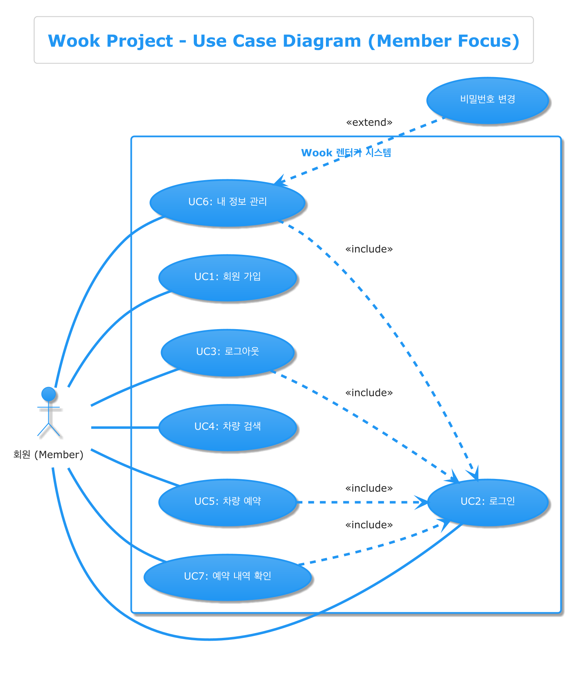

# What I Learn

## [1 - UML](#1UML)
## [2 - 예외](#2예외)
## [3 - API와 BindingResult](#3api와-bindingresult)
## [4 - 로그인 실패 로직](#4로그인-실패-로직)
## [5 - 유지보수를 위한 전략(Entity)](#5유지보수를-위한-전략Entity)
## [6 - MapStruct](#6MapStruct)
## [7 - Build](#7build)

## 1.UML

### 1.1 목적

개발하고자 하는 목적을 정확하게 설계하고 타인에게 가독성을 제공, 설명의 용이성을 위해 아키텍처 다이어그램을 사용하려고 했다. Draw.io혹은 Figma를 이용하여 아키텍처를 이미지 형식으로 만들 수는 있으나 이미지 하나로 의도를 표현하기에는 제한적이여서 설명을 텍스트 형식으로 제공해야만 하는 필요성이 있었다. 알아보는 과정에서 UML이라는 것으로 개발자, 기획자, 디자이너 간의 의사소통 도구로 사용하고자 했다.

### 1.2 과정

구글 AI Gemini를 이용하여 기초부터 학습을 도와달라고 했다. 그 과정에서 내가 필요한 부분을 기록하고 이용할 계획이다.

### 1.3 내용

####  유스케이스 다이어그램 :

- 목적
  - 이 다이어그램은 사용자관점에서 시스템이 어떤 기능을 제공하는지 보여주려고 만든다. 시스템이 어떻게 기능을 수행하는지 구현 로직을 다루지는 않는다. 프로젝트 초기 요구사항을 파악하고 시스템의 범위를 정의하는 데 사용된다.

- 주요 구성
    - 액터 :  시스템과 상호작용하는 외부의 사람이나 다른 시스템을  의미한다. 졸라맨 같은 그림으로 표현된다. 

    - 유스케이스 : 액터가 시스템을 통해 달성하고자 하는 구체적인 목표나 기능이다. 타원안에 유스케이스 이름을 적어 표현한다. (회원가입,로그인)

    - 시스템 경계 : 모델링 대상 시스템의 범위를 나타내는 사각형 상자이다. 유스케이스들은 보통 이 상자 안에 위치한다.

- 관계 
    - 연관 : 액터와 유스케이스 간의 상호작용을 나타낸다. 실선으로 연결한다.
    - 포함 : 하나의 유스케이스가 다른 유스케이스의 기능을 반드시 포함하여 수행할 때 사용한다. 포함하는 유스케이스에서 포함되는 유스케이스로 점선 화살표와 함께 include 스트레오타입을 표시한다.
    - 확장 : 기본 유스케이스의 흐름에 선택적 흐름이 추가될 수 있음을 나타낸다. 예를 들어, "로그인"유스케이스에서 특정 조건시 "계정 잠금"유스케이스가 확장될 수 있다. 확장하는 유스케이스에서 기본 유스케이스로 점선 화살표와 함께 extend 스테레오타입을 표시한다.
    - 일반화 : 액터 간 또는 유스케이스 간의 상속 관계를 나타낸다. 속이 빈 삼각형 화살표가 달린 실선으로 표현한다.
#### 클래스 다이어그램 : 

- 목적
  - 시스템을 구성하는 클래스가 가지는 속성과 메서드 그리고 클래스들 사이의 관계(연관,상속,의존)를 시각적으로 표현한다.
  
- 주요 구성
  - 클래스 - 보통 세 칸으로 나눈 사각형 상자로 표현된다.
    - 상단 : 클래스의 이름(굵게 표시되기도 한다)
    - 중간 : 클래스의 속성(멤버 변수,필드) \
      `표기형식 : (접근제한자 속성명:타입) {예) -id:Long,+name: String`}
    - 하단 : 클래스의 메서드 \
      `표기형식 : (접근제한자 메서드명 : 반환타입) {예) +updateMember(dto:MemberDTO):void}`
    - 접근 제한자 : -(private),+(public),#(protected),~(default)
  
  - 관계 - 클래스 상자들을 연결하는 선으로 표현한다.
    - 연관 : 클래스 간의 일반적인 관계를 나타내는 실선이다.
      - 다중성 : 관계의 양 끝에 숫자로 표시하며, 각 클래스의 인스턴스가 관계에 얼마나 참여할 수 있는지를 나타낸다.
      
    ```
    1 : 정확히 하나
    * : 0개 이상(Many)
    0..1 : 0개 또는 1개
    1..* : 1개 이상
     ```
      - 역할명 : 관계에서 각 클래스가 맡는 역할을 선 끝에 명시할 수 있다,(선택사항이다)
      - 방향성 : 선 끝에 화살표를 표시하여 한 클래스에서 다른 클래스로 참조(탐색) 할 수 있는 방향을 나타낼 수 있다. 양방향일 경우 화살표를 생략하기도 한다. JPA의 mappedBy와 관련이 있다. 
  - 일반화 : 자식 클래스가 부모 클래스를 상속하는 관걔를 나타낸다. 자식 클래스에서 부모 클래스로 향하는 속이 빈 삼각형 화살표가 달린 실선으로 표현한다. (예 : Child --|> Parent)
  
  - 실현 : 클래스가 인터페이스를 구현하는 관계를 나타낸다. 구현 클래스에서 인터페이스로 향하는 속이 빈 삼각형 화살표가 달린 점선으로 표현한다. (예 :ClassA ..|> Interface)

  - 의존 : 한 클래스가 다른 클래스를 짧은 시간 동안 사용하는 관계 (예를 들어 메서드의 파라미터로 사용된다거나 메서드 내에서 지역 변수로 생성/사용 하는경우)를 나타낸다. 사용하는 클래스에서 사용되는 클래스로 향하는 열린 화살표가 달린 점선으로 표현한다. (예 : Client ..> Supplier <<use>>,<<call>>,<<create>>) 

  - 집합 : 클래스 쪽에 속이 빈 마름모가 달린 실선으로 표현한다. 부분 클래스는 전체 없이 독립적으로 존재할 수 있다. 전체 클래스 쪽에 마름모 기호(o)를 붙여 준다 (예: ClassA o-- ClassB)

  - 합성 : 더 강한 관계를 나타내며, 전체 클래스 쪽에 속이 채워진 마름모가 달린 실선으로 표현한다. 부분 클래스는 전체 없이 존재할 수 없다. 전체 클래스 쪽에 채워진 마름모 기호(*)를 붙인다. (예 : ClassA *-- ClassB)

#### 시퀀스 다이어그램
  - 목적 : 유스케이스나 시나리오가 실행될 때, 관련된 객체 또는 컴포넌트들이 어떤 순서로 메시지를 주고받으며 협력하는지를 시각적으로 표현한다.

  - 주요 구성
    - 라이프라인 : 다이어그램 상단에 위치한 객체(또는 컴포넌트)로부터 아래로 내려오는 세로 점선이다. 해당 객체가 시나리오 동안 존재함을 나타낸다. 상단에는 보통 `객체명:클래스명` 또는 `:클래스명(익명객체)`를 표시한다.
    - 액터 : 시나리오를 시작하는 사용자를 나타낸다.
    - 활성 바 : 라이프라인 위에 그려지는 세로 직사각형 이다. 해당 객체가 메시지를 받아 작업을 수행하는 기간을 나타낸다.
    - 메시지 : 라이프라인 사이를 연결하는 화살표로, 객체 간의 상호작용을 나타낸다.
      - 동기 메시지 : `실선 + 속이 채워진 화살촉 (->)` 메시지를 보낸 객체는 받는 객체의 작업이 완료되고 응답을 받을 때까지 기다린다. 일반적인 메서드 호출을 나타낸다.
      - 비동기 메시지 : `실선 + 열린 화살촉 (->>)` 송신자는 메시지를 보낸 후 수신자의 완료를 기다리지 않고 자신의 작업을 계속합니다.
      - 응답 메시지 : `점선 + 열린 화살촉(-->)` 동기 메시지 호출이 완료된 후, 제어권이 호출자에게 돌아가는 것을 나타낸다. 때로는 명확성을 위해 생략하기도 한다.
      - 자가 메시지 : 화살표가 자신의 라이프라인에서 시작하여 자신의 라이프라인으로 돌아오는 형태이다. 객체가 자신의 메서드를 호출하는 경우를 나타낸다.
    

### 1.4 참고자료
- #### __클래스 다이어그램__
  
- #### __시퀀스 다이어그램__
  
- #### __유스케이스 다이어그램__
  
- #### __PlantUML를 IntelliJ에 설치하기__
  - [설치하는 방법을 정리한 블로그 ](https://tg360.tistory.com/entry/PlantUML-%EC%9D%84-%EC%9D%B4%EC%9A%A9%ED%95%98%EC%97%AC-%EB%8B%A4%EC%9D%B4%EC%96%B4%EA%B7%B8%EB%9E%A8%EC%9D%84-%EC%89%BD%EA%B2%8C-%EA%B7%B8%EB%A6%AC%EC%9E%90-%EC%86%8C%EA%B0%9C-%EB%B0%8F-%EC%84%A4%EC%B9%98)
- #### __PlantUML 공식 사이트__
  - [공식사이트](https://plantuml.com/ko/class-diagram)

### 1.4 결과
- [개인 프로젝트 도메인 클래스 다이어그램 링크](WookProject.puml)

---
- [개인 프로젝트 유스케이스 다이어그램 링크](WookProject_UseCase.puml)

---
- [WookProject_Sequence.puml](WookProject_Sequence.puml)


### 1.5 소감

이전에 JPA를 다루면서 OneToOne,ManyToOne관계와 단방향,양방향 관계에 대해 상당히 헷갈리고 개념이 잡히지 않았다. UML을 배우면서 각 객체의 상호작용에 대해 깊게 고민하보다보니 허술한 설계를 바로잡을 수 있는 기회가 되었다.


## 2.예외
### 2.1 목적
  웹 애플리케이션의 예외 처리 설계 중에서 예측 가능한 오류와 예측 불가능한 오류에 대해 어떻게 구분하고 처리할 것인가에 대한 고민을 했다.
### 2.2 과정
 예외와 관련된 질문을 AI를 통해 답변을 받고, 각종 블로그를 통해 개발자들의 생각을 모아 정리해보았다.   
예외를 던지고 예외를 받아 처리하는 로직과 ExceptionHandler,ControllerAdvice로 전역 예외 처리를 프로젝트에 적용하며 테스트 하였다. 
### 2.3 내용

예측 가능한 예외 - 개발자와 사용자 모두가 예상할 수 있는 오류
- 주로 사용자 입력, 비즈니스 규칙 위반, 요청 파라미터 부족
- 예: 로그인 실패, 중복된 이메일, 잔액 부족, 유효성 검사 실패 등
- 커스텀 예외 생성 -> 전역 예외 처리 -> 정확한 HTTP 상태 코드 반환 

예측 불가능한 예외 - 개발자가 전혀 의도하지 않았거나 예측할 수 없는 오류
- 외부 API 오류, DB연결 오류, 타임 아웃, NPE 등
- 클라이언트의 잘못이 아닌 서버 내부 문제
- 전역 예외 캐치 -> 500 상태 코드 응답 -> 에러 로그 기록 -> 관리자 알림

`Checked or Unchecked의 중요한 판단 기준:`**이 예외가 발생했을 때, 이 메서드를 호출하는 쪽(클라이언트 또는 상위 서비스)에서 이 상황을 인지하고 의미 있는 복구 조치를 취할 수 있는가? 또는 반드시 취해야만 하는가?**


예측 불가능한 오류 처리 전략
- 사용자에게는 너무 구체적인 메시지를 노출하지 않아야 한다.
- 전역 Exception처리
- 로그 남기기(StackTrace)
- 사용자에게는 "예상치 못한 오류" 메시지만 반환
  - ```java
      @ExceptionHandler(Exception.class)
      public ResponseEntity<ErrorResponse> handleException(Exception ex) {
      log.error("예기치 못한 에러 발생", ex);
      return ResponseEntity.status(HttpStatus.INTERNAL_SERVER_ERROR).body(new ErrorResponse("INTERNAL_ERROR", "예상치 못한 오류가 발생했습니다. 관리자에게 문의하세요."));}
    ```
### 2.4 결과
  Checked Exception을 사용할 경우 예외처리에 대한 로직이 강제되지만 유연하지 못하는 단점이 있다. 반면, Unchecked Exception을 사용할 경우 실패를 명시적으로 catch하거나 throws를 할 필요가 없으므로 코드가 더 깔끔해질 수 있다는 장점을 가져갈 수 있으나 매번 예외의 존재를 검증하고 확인해야 하는 단점이 있다. 확실한 가이드 라인이 없기 때문에 개발자는 예외에 대한 예측을 하고 처리방향에 대하여 고민할 필요가 있다.
### 2.5 소감
  개발자는 사용자의 사용경험을 저해하지 않도록 예외에 대하여 촘촘히 설계 하되, 예측 불가능한 부분에 대해서는 기록하고 사후를 빠르게 해야겠다고 느겼다.


## 3.API와 BindingResult
### 3.1 목적
   API로 다국어 지원을 통한 유효성검사를 진행하고자 하였다.
### 3.2 과정
  프로젝트 진행도중 form-data를 실행할 때에는 BindingResult설정만으로 다국어 지원을 이용하여 BeanValidation 커스텀 유효성 검사를 진행하였는데 API로 BindingResult와 다국어지원이 적용이 안되는 문제를 발견하였다.
### 3.3 내용
  컨트롤러 메서드에서 BindingResult객체를 받아서 JSON으로 반환하면, 메세지 조회 및 지역화 과정이 실행되지 않는다. Jackson은 BindingResult 객체의 내부 구조를 그대로 JSON으로 만들 뿐, MessageSource를 호출하여 현재 로케일에 맞는 메시지로 변환해주는 기능을 알지 못하고 수행하지도 않는다. 
### 3.4 결과
  전역 예외 처리를 통하여(@RestControllerAdvice) MessageSource를 통하여 설정한 커스텀 다국어 지원 메세지를 보내였다.
```java
@RequiredArgsConstructor
public class RegisterExceptionHandler {
    private final MessageSource messageSource;

    @ExceptionHandler(MethodArgumentNotValidException.class)
    public ResponseEntity<ApiResponseDTO<Map<String, String>>> ValidException(MethodArgumentNotValidException ex, Locale locale) {
        Map<String, String> errors = new HashMap<>();
        for (FieldError error : ex.getBindingResult().getFieldErrors()) {
            // 메시지 코드 (messages_ko.properties 키) → 메시지 값
            String message = messageSource.getMessage(error, locale);
            errors.put(error.getField(), message);
        }
        log.error("Exception Handler{}", errors);
        return ResponseEntity.badRequest().body(new ApiResponseDTO<>(false, "로그인이 실패했습니다", errors));
    }
}
 ```
### 3.5 소감
 실패하는 로직은 로그를 출력해보고 디버깅을 통해 어떻게 순서로 실행되는지 연구할 필요가 있다. 문제가 없어보이던 문제점이 생각지 못하게 발견되어 번거롭더라도 직접 검증의 필요성을 느꼈다.


## 4.로그인 실패 로직
### 4.1 목적
  매크로를 이용하여 로그인 시도가 매우 많을 것을 대비하여 실패 횟수와 실패 횟수 달성시 잠금시간으로 악의적인 공격을 막기위해 로직을 작성했다.
### 4.2 과정
  예외를 작성하는 도중 로그인 실패 시 로그인을 차단하는 로직을 예외 처리하려니 난이도가 높아져서 좀 더 쉽고 빠르게 해당 로직을 작성하는 방법에 대해 모색해봤다.
### 4.3 내용
  Spring Security는 로그인 성공 또는 실패 시 특정 이벤트를 발행한다.
실패 이벤트를 추적 할 수 있는 `AuthenticationFailureBadCredentialsEvent`라는 객체가 있다.
이 이벤트가 발생하게 되면 사용자의 실패 횟수를 기록하고 증가시킬 수 있다.
또한, 로그인 성공 이벤트가 발생하면 추적 할 수 잇는 `AuthenticationSuccessEvent`라는 객체가 있다. 이 이벤트가 발생하면 사용자의 로그인 성공을 추척하고 실패횟수를 초기화 할 수 있다.
### 4.4 결과
  엔티티 객체에 실패 횟수를 저장할 수 있는 필드와 잠금 해제 시간 필드를 추가하였다.로그인 성공/실패 이벤트 리스너를 생성하기 위해 컴포넌트를 만들었다.  
아래는 컴포넌트를 만든 코드이다.
```java
package me.changwook.configuration.config.security;

import lombok.RequiredArgsConstructor;
import lombok.extern.slf4j.Slf4j;
import me.changwook.repository.MemberRepository;
import org.springframework.beans.factory.annotation.Value;
import org.springframework.context.event.EventListener;
import org.springframework.security.authentication.event.AuthenticationFailureBadCredentialsEvent;
import org.springframework.security.authentication.event.AuthenticationSuccessEvent;
import org.springframework.stereotype.Component;
import org.springframework.transaction.annotation.Transactional;

import java.time.LocalDateTime;

@Slf4j
@Component
@RequiredArgsConstructor
public class AuthenticationEventsListener {

    private final MemberRepository memberRepository;

    @Value("${security.login.max-attempts}")
    private int maxAttempts;

    @Value("${security.login.lockout-duration-minutes}")
    private int lockoutDurationMinutes;

    @EventListener
    @Transactional
    public void handleAuthenticationFailure(AuthenticationFailureBadCredentialsEvent event) {
        String username = event.getAuthentication().getName();
        log.warn("Login failure for user:{}", username);

        memberRepository.findByEmail(username).ifPresent(member -> {
            member.incrementFailedLoginAttempts();
            log.info("User{} failed login attempts:{}", username,member.getFailedLoginAttempts());

            if(member.getFailedLoginAttempts() >= maxAttempts) {
                LocalDateTime unlockTime = LocalDateTime.now().plusMinutes(lockoutDurationMinutes);
                member.lockAccount(unlockTime);
                log.warn("User{} account locked until{}",username,unlockTime);
            }
            memberRepository.save(member);
        });
    }

    @EventListener
    @Transactional
    public void handleAuthenticationSuccess(AuthenticationSuccessEvent event) {
        String username = event.getAuthentication().getName();
        log.info("Login success for user:{}", username);

        memberRepository.findByEmail(username).ifPresent(member -> {
           if(member.getFailedLoginAttempts() > 0 || member.getAccountLockedUntil() != null){
               member.resetLoginAttempts();
               memberRepository.save(member);
               log.info("Reset failed login attempts for user: {}",username);
           }
        });
    }
}
```
아래는 서비스 레이어를 수정한 코드이다.
```java
package me.changwook.service.impl;

import lombok.RequiredArgsConstructor;
import lombok.extern.slf4j.Slf4j;
import me.changwook.configuration.config.security.CustomUserDetails;
import me.changwook.domain.Member;
import me.changwook.repository.MemberRepository;
import org.springframework.security.authentication.LockedException;
import org.springframework.security.core.userdetails.UserDetails;
import org.springframework.security.core.userdetails.UserDetailsService;
import org.springframework.security.core.userdetails.UsernameNotFoundException;
import org.springframework.stereotype.Service;
import org.springframework.transaction.annotation.Transactional;


@Service
@RequiredArgsConstructor
@Slf4j
public class CustomUserDetailsService implements UserDetailsService {

    private final MemberRepository memberRepository;

    @Override
    @Transactional(readOnly = true)
    public UserDetails loadUserByUsername(String username) throws UsernameNotFoundException, LockedException {

        Member member = memberRepository.findByEmail(username).orElseThrow(() -> new UsernameNotFoundException("사용자를 찾을 수 없습니다."));

        if(member.isAccountLocked()){
            log.warn("Attempted login to locked account:{}",username);
            throw new LockedException("사용자 계정이 잠겨있습니다. 잠시 후 다시 시도해주세요.");
        }

         return memberRepository.findByEmail(username)
                .map(CustomUserDetails::new)
                .orElseThrow(() -> new UsernameNotFoundException("사용자를 찾을 수 없습니다."));

    }
}

```
### 4.5 소감
  전역 예외처리를 이용하려 하니 제한 사항이 너무 많았다. Spring Security를 통해서 로그인 차단 로직은 비교적 매우 쉬웠다. 보안 강화 로직에 대해 조사하다 보니 다양한 방식으로 보안을 강화 할 수 있다는 것을 알았다. 기회가 된다면 CAPCHA,2단계 인증,특정 IP 주소에서 과도한 로그인 시도 차단을 접목 시키고 싶다. 

## 5.유지보수를 위한 전략(Entity)
### 5.1 목적
  유지보수를 함에 있어서 난이도를 낮추는 방식을 도입하여 프로젝트의 유지보수성을 높이기 위하여 설계 방식을 알아보았다.
### 5.2 과정
  프로젝트 진행 중 더티체킹을 위하여 DTO객체를 매개변수로 받아 엔티티 객체의 변경을 감지하는 로직을 작성 중 DTO객체에 의존성이 높아지는 것 같다는 생가을 했다. Service 레이어에서 비즈니스 로직을 모두 작성하는 것이 과연 좋은 DDD방식일지를 고민하였다.
### 5.3 내용
  DTO는 주로 Controller나 View와 같이 외부 계층과의 데이터 전달을 위해 사용되는 객체이다. 도메인 모델은 애플리케이션의 핵심 비즈니스 로직과 상태를 나타내며, 가급적 외부 계층의 변화에 영향을 받지 않도록 독립성을 유지하는 것이 좋다(관심사 분리).   
  API 스펙 변경 등으로 DTO의 구조가 변경되면, 핵심 도멘인 객체 엔티티까지 수정해야 하는 커플링이 발생한다. 이는 유지보수성을 저하시키는 요인이 된다.   
  엔티티가 데이터뿐만 아니라 관련된 비즈니스 행위까지 함께 가지는 방식을 **풍부한 도메인 모델** 이라고 한다.
####   풍부한 도메인 모델
  - 장점
    - 높은 응집도 : 데이터와 관련된 행위가 한 클래스 안에 모여 있다.
    - 강한 캡슐화 : 엔티티 내부 상태는 외부에서 직접 접근/변경하기 어렵고,오직 공개된비즈니스 메서드를 통해서만 가능하다. 객체의 일관성 유지가 용이핟.
    - Service 계층 단순화 : Service 계층은 주로 트랜잭션 관리,도메인 객체 간의 협력 조정,DTO변환 등 오케스트레이션 역할에 집중할 수 있다.   
      (오케스트레이션 : 각 작업이 서로 연관되어 특정 기능을 수행하도록 관리하는 것을 말한다.)
### 5.4 결과
  아래는 나의 프로젝트 코드 일부이다.
```java
package me.changwook.domain;

import jakarta.persistence.*;
import jakarta.validation.constraints.NotNull;
import lombok.*;
import me.changwook.DTO.MemberDTO;

@Entity
@Getter
@NoArgsConstructor(access = AccessLevel.PROTECTED)
@AllArgsConstructor(access = AccessLevel.PROTECTED)
@Builder
public class Member {
    @Id
    @GeneratedValue(strategy = GenerationType.IDENTITY)
    @Column(name = "member_id",updatable = false)
    private Long id;

    private String name;

    @Column(columnDefinition = "BOOLEAN")
    private Boolean licence = false;

    @Column(unique = true, nullable = false)
    private String email;

    private String phone;

    private String address;

    private String password;

    @OneToOne(fetch = FetchType.LAZY,cascade = CascadeType.ALL)
    @JoinColumn(name = "rent_id")
    private Rent rent;

    //더티 체킹을 위한 메서드
    public void updateMember(MemberDTO memberDTO){
        this.name = memberDTO.getName();
        this.licence = memberDTO.getLicence();
    }
}
```
프로젝트 중 고민했던 내용은 아래와 같다.
1. **더티 체킹을 위한 메서드와 필드값을 변경하는 메서드를 Service레이어에 생성할 것인가**  
2. **DTO에 대한 의존성이 너무 높아 DTO도 변경하고 메서드도 변경하는 유지보수성 악화를 어떻게 해결할 것인가**   
#### 해결책
1. 더티 체킹을 위한 메서드를 Service레이어에 생성한다. 다만, 엔티티 객체의 필드값(데이터)를 변경하는 메서드는 엔티티 객체 내부에 작성한다.
2. DTO를 매개변수로 받아와서 전부를 바꾸는 것은 DTO에 대한 의존성이 높기 때문에 일부의 필드값만을 변경하는 메서드를 작성한다.   
`updateProfile(String name, boolean licence), changeEmail(String newEmail)`
### 5.5 소감
유지보수성은 협업을 하는데 필수적인 요소이다. 단순하게 작동만으로 개발하게 된다면 협업하는데 큰 방해요소로 다가 올 것이다. 그렇기에 기본에 충실한 개발을 해야한다고 생각했다.
  

## 6.MapStruct
### 6.1 목적
  DTO와 엔티티 객체를 변환하는 과정에서 유지보수 난이도가 높아져 이를 해결하고자 라이브러리를 도입하게 되었다.
### 6.2 과정
  엔티티 객체에 필드를 변경할 경우, DTO객체와 엔티티 객체를 변환하는 매퍼클래스를 각각 변환해야하는 경우가 생겼다. 이를 해결하기 위하여 라이브러리 중 MapSturct를 적용하고자 했다.
  무엇보다 MapSturct는 컴파일 시 매핑 오류를 발견할 수 있게 되었다.
### 6.3 내용
  MapStruct는 Java의 어노테이션 프로세서로 동작한다. 컴파일 과정에서 @Mapper 어노테이션이 붙은 인터페이스를 찾아내고, 정의된 매핑 규칙에 따라 해당 인터페이스의 구현 클래스를 생성한다. 이생성된 코드가 실제 매핑 로직을 수행한다.
### 6.4 결과
### 6.5 소감

## 7.build
### 7.1 목적
  프로젝트를 실행하는데 빈 이름 중복 에러가 생겼다.
에러 코드에는 MapStruct를 사용하고 있는데 
  build tool을 인텔리제이로 할 것인지 gradle로 할 것인지
### 7.2 과정
### 7.3 내용
### 7,4 결과
### 7.5 소감

## 8.EventListener
### 8.1 목적
### 8.2 과정
### 8.3 내용
### 8.4 결과
### 8.5 소감